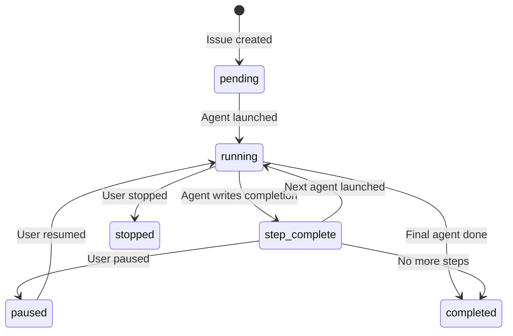

# Workflow Lifecycle

Nexus runs AI agents in a chain defined by workflow YAML files. Each workflow has a sequence of steps, and each step is
assigned to an agent type.

## Workflow Tiers

| Tier           | Steps      | Use Case                                       |
|----------------|------------|------------------------------------------------|
| **Full SOP**   | 8-9 agents | Feature requests (design + all quality gates)  |
| **Shortened**  | 5-6 agents | Bug fixes (skip vision/UX, keep quality gates) |
| **Fast-Track** | 3-4 agents | Hotfixes, chores (minimal overhead)            |

### Typical Full SOP Chain

```
ProjectLead → CTO → Architect → ProductDesigner → Tier2Lead → QAGuard → Privacy → OpsCommander → Scribe
   (Triage)   (Vision) (Design)    (UX)           (Build)     (Test)   (Audit)   (Deploy)      (Docs)
```

### Shortened

```
ProjectLead → CTO → Architect → Tier2Lead → QAGuard → OpsCommander
```

### Fast-Track

```
ProjectLead → Tier2Lead → QAGuard → OpsCommander
```

## Lifecycle States



## Step Execution

For each step in the workflow:

1. **Select Agent** — Look up agent_type in the workflow definition
2. **Generate Prompt** — Build the context prompt from the issue, previous outputs, and workflow YAML instructions
3. **Launch** — Spawn `gh copilot` (or other AI provider) as a subprocess
4. **Monitor** — Track PID, detect timeout (configurable per-step)
5. **Detect Completion** — Watch for completion summary (file or POST)
6. **Chain** — If `next_agent` is specified, launch the next step

## Workflow Definition (YAML)

```yaml
name: development_workflow
description: Standard software development workflow

workflow_types:
  full:
    steps:
      - id: triage
        agent_type: triage
        description: "Analyze and categorize the task"
        timeout: 600
        retry_policy:
          max_retries: 2
          backoff: exponential

      - id: design
        agent_type: architect
        description: "Create technical design"
        timeout: 1200

      - id: implement
        agent_type: developer
        description: "Write the code"
        timeout: 3600

      - id: review
        agent_type: reviewer
        description: "Review and test"

monitoring:
  log_all_decisions: true
  audit_trail: "github_comments"
  require_human_merge_approval: true
```

## Approval Gates

The system enforces human review at critical points:

| Project Config   | Workflow Config | Result                  |
|------------------|-----------------|-------------------------|
| `always`         | [ignored]       | Human approval REQUIRED |
| `workflow-based` | `true`          | Human approval required |
| `workflow-based` | `false`         | Auto-merge allowed      |
| `never`          | [ignored]       | Auto-merge always       |

When approval is required, `@OpsCommander` posts "🚀 Deployment ready. PR requires human review" and waits.

## State Tracking

Workflow state is persisted by the `WorkflowStateEnginePlugin`:

- **Filesystem**: JSON files in `.nexus/workflows/`
- **Postgres**: `nexus_workflows` table

The `HostStateManager` separately tracks:

- `launched_agents.json` — PIDs with 2-minute TTL
- `tracked_issues.json` — User subscriptions for notifications

## Retry and Timeout

- **Timeout**: Configurable per step (default 60s). Stuck agents are killed via `SIGTERM`
- **Retries**: Up to 3 attempts per agent per issue with exponential backoff
- **Counters**: Per-issue, per-agent. Reset on successful completion
